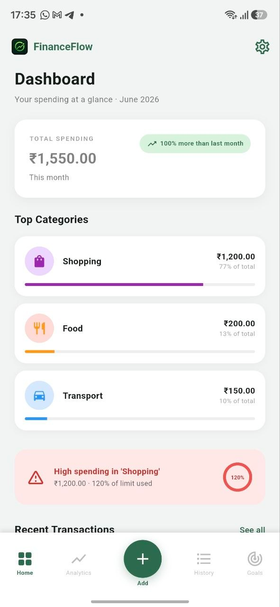
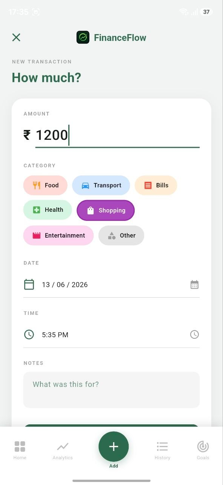
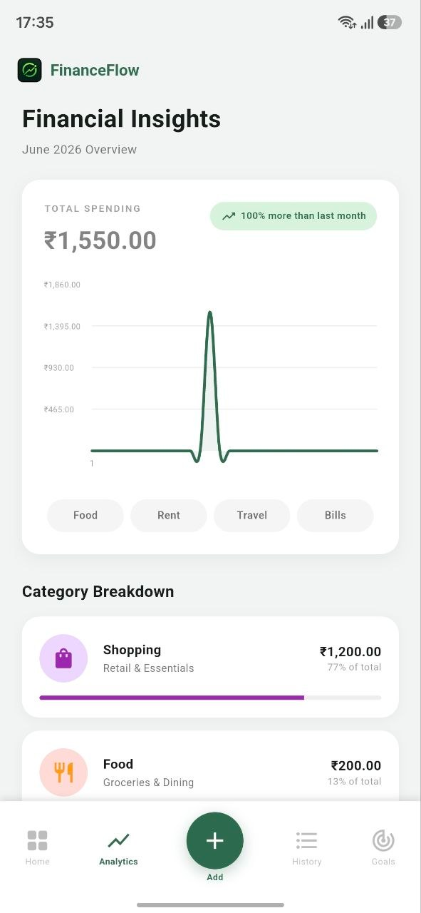
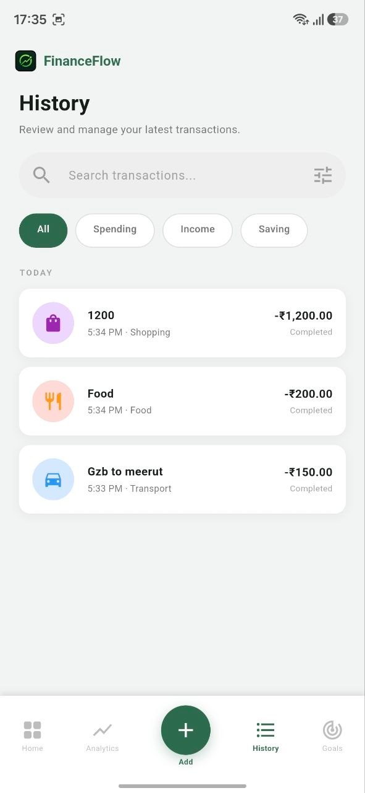
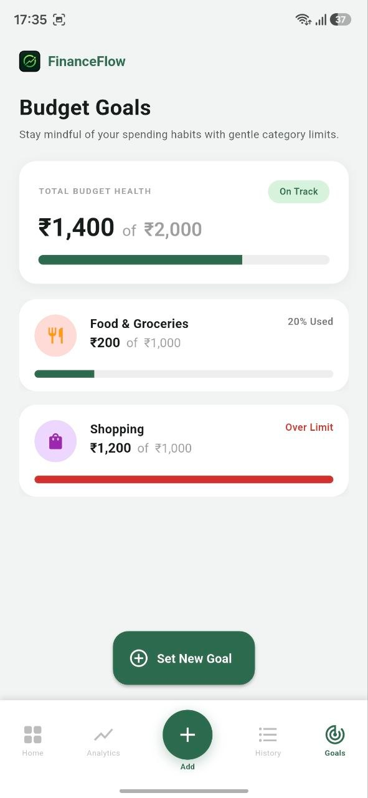

# 💸 FinanceFlow

> A beautifully designed, fully offline Flutter expense tracker — built for people who want clarity over their money without the cloud.

<p align="center">  
  
  <a href="https://github.com/sakshiv3107/FinanceFlow/releases/download/v1.1.0/FinanceFlow.apk">
    
  </a>
  
  
  
</p>

---

## 📖 Description

FinanceFlow is a local-first personal finance app that helps you track daily expenses, visualise spending patterns, and manage monthly budgets — all without an internet connection. Every rupee you log is stored directly on your device using Hive, so your data is always private, always available, and never lost between sessions.

---

## ✨ Features

- **Add & manage expenses** — log amount, category, date, time, and optional notes
- **Dashboard (Home)** — monthly total at a glance, recent transactions, category summary cards
- **Analytics** — line chart for daily spending, category breakdown, month-over-month comparison
- **Transaction history** — search by keyword, filter by type, swipe to delete with undo
- **Budget goals** — set per-category monthly limits with visual progress indicators
- **Smart alerts** — warning when any category crosses 80% of its budget
- **Budget insight on add** — real-time hint showing projected budget % while adding an expense
- **Dark / Light theme** — system-aware with manual toggle via segmented control
- **CSV export** — export all transactions for use in spreadsheets
- **Fully offline** — all data stored locally via Hive, no internet required
- **Persistent storage** — data survives app restarts, phone restarts, and updates

---

## 📸 Screenshots

|Dashboard| Add Expense | Analytics | History |  Goals
|---|---|---|--|---|
|  |   |  |  | 


---

## 🏗️ Project Structure

```
lib/
├── core/
│   ├── constants.dart          # categories, colors, icons, currency symbol
│   ├── router.dart             # go_router config — all named routes
│   └── theme.dart              # ThemeData light + dark (seed: #2D6A4F)
├── data/
│   ├── models/
│   │   ├── expense.dart        # freezed model + Hive adapter (typeId: 0)
│   │   └── goals.dart         # freezed model + Hive adapter (typeId: 1)
│   └── repositories/
│       ├── expense_repo.dart   # CRUD via Hive box 'expenses'
│       └── goals_repo.dart    # CRUD via Hive box 'budgets'
├── presentation/
│   ├── dashboard/
│   │   ├── dashboard_screen.dart
│   │   └── dashboard_provider.dart   # expenseListProvider, monthlyTotalProvider, etc.
│   ├── add_expense/
│   │   └── add_expense_screen.dart
│   ├── analytics/
│   │   ├── analytics_screen.dart
│   │   └── analytics_provider.dart   # dailyBreakdownProvider, selectedMonthProvider, etc.
│   ├── history/
│   │   └── history_screen.dart
│   ├── budget/
│   │   ├── goals_screen.dart
│   │   └── goals_provider.dart      # budgetListProvider, budgetProgressProvider, etc.
│   ├── settings/
│   │   └── settings_screen.dart      # theme toggle, CSV export, clear data
│   └── widgets/
│       ├── category_chip.dart
│       ├── amount_card.dart
│       └── bottom_nav_bar.dart
└── main.dart                         # Hive init, adapter registration, ProviderScope
```

---

## 🛠️ Tech Stack

| Layer | Package | Version | Purpose |
|---|---|---|---|
| State management | `flutter_riverpod` | ^2.5.1 | Providers, StateNotifier, derived state |
| Local storage | `hive_flutter` | ^1.1.0 | NoSQL object store, persistent on device |
| Data models | `freezed` | ^2.5.2 | Immutable models, `copyWith`, `==`, `hashCode` |
| Charts | `fl_chart` | ^0.68.0 | Line chart (daily), pie chart (categories) |
| Navigation | `go_router` | ^13.2.0 | Declarative routing |
| Notifications | `flutter_local_notifications` | ^17.2.2 | Budget limit alerts |
| Image | `image_picker` | ^1.1.2 | Receipt photo from camera / gallery |
| Formatting | `intl` | ^0.19.0 | Currency (₹) and date formatting |
| IDs | `uuid` | ^4.4.0 | Unique IDs for expense and budget records |
| Code gen | `build_runner` + `hive_generator` + `freezed_annotation` | — | Auto-generates Hive adapters and model boilerplate |

---

## 🚀 Getting Started

### Prerequisites

- Flutter SDK `>=3.0.0`
- Dart SDK `>=3.0.0`
- Android Studio or VS Code with the Flutter extension
- A connected device or emulator

### Installation

```bash
# 1. Clone the repository
git clone https://github.com/your-username/financeflow.git
cd financeflow

# 2. Install dependencies
flutter pub get

# 3. Run code generation (freezed models + Hive adapters)
dart run build_runner build --delete-conflicting-outputs

# 4. Run the app in debug mode
flutter run
```

### Run on a physical device (release mode)

```bash
flutter run --release
```

---

## 📦 pubspec.yaml — Key Dependencies

```yaml
dependencies:
  flutter_riverpod: ^2.5.1
  hive_flutter: ^1.1.0
  freezed_annotation: ^2.4.1
  fl_chart: ^0.68.0
  go_router: ^13.2.0
  flutter_local_notifications: ^17.2.2
  image_picker: ^1.1.2
  intl: ^0.19.0
  uuid: ^4.4.0

dev_dependencies:
  build_runner: ^2.4.9
  hive_generator: ^2.0.1
  freezed: ^2.5.2
```

---


---

## 💾 Data Persistence

FinanceFlow is **fully offline and locally persistent**. Here is how it works:

- On first launch, `main.dart` calls `Hive.initFlutter()` and opens two boxes: `expenses` and `budgets`
- Every write operation (`addExpense`, `deleteExpense`, `setBudget`) calls through to the Hive box immediately — data is written to disk synchronously
- On every subsequent launch, `ExpenseNotifier` and `BudgetNotifier` load their full state from the Hive box in their constructors:

```dart
ExpenseNotifier(this._repo) : super([]) {
  state = _repo.getAllExpenses(); // loads persisted data on startup
}
```

- Closing the app, restarting the phone, or updating the app **does not erase data**
- Data is only removed when the user explicitly deletes a transaction or uses "Clear all data" in Settings

---

## 🗺️ Navigation

Routes are defined in `lib/core/router.dart` using `go_router`:

| Route | Screen |
|---|---|
| `/` | DashboardScreen (Home) |
| `/add` | AddExpenseScreen |
| `/analytics` | AnalyticsScreen |
| `/history` | HistoryScreen |
| `/goals` | GoalsScreen (Goals) |
| `/settings` | SettingsScreen |

---


## 🧪 Testing

> Testing setup is planned for v1.1.0. Recommended strategy:

- **Unit tests** — `ExpenseRepository` CRUD, `budgetProgressProvider` ratio calculation, date grouping logic in History
- **Widget tests** — `AddExpenseScreen` form validation, `DashboardScreen` empty state
- **Integration tests** — full add → view → delete expense flow using `flutter_test` + `integration_test`

Run tests (once written):
```bash
flutter test
flutter test integration_test/
```

---

## 🚢 Deployment

### Android

```bash
flutter build apk --release
# Output: build/app/outputs/flutter-apk/app-release.apk

flutter build appbundle --release
# Output: build/app/outputs/bundle/release/app-release.aab
```

Upload the `.aab` to Google Play Console.

### iOS

```bash
flutter build ios --release
```

Open `ios/Runner.xcworkspace` in Xcode, set your signing team, and archive for App Store submission.

### Environment variables

No environment variables are required — the app is fully offline with no API keys or remote services.

---


## 🙋‍♀️ Author

**Sakshi** — Flutter Developer
[GitHub](https://github.com/your-username) · [Portfolio](https://sakshix.tech) · [LinkedIn](https://linkedin.com/in/your-profile)

---

## 📄 License

This project is licensed under the MIT License — see [LICENSE](LICENSE) for details.

---

## 🔗 Useful Links

- [Flutter docs](https://docs.flutter.dev)
- [Riverpod docs](https://riverpod.dev)
- [Hive docs](https://docs.hivedb.dev)
- [fl_chart docs](https://pub.dev/packages/fl_chart)
- [go_router docs](https://pub.dev/packages/go_router)
